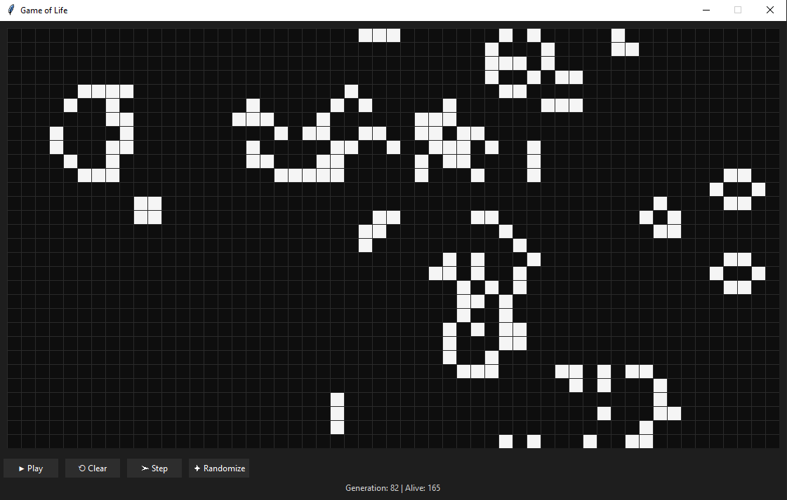

# Conway's Game of Life — Tkinter




An exemplary Python implementation of **Conway's Game of Life** with a Tkinter GUI.  
This repository is primarily intended as a **demonstration of Git, GitHub workflows, and clean project structure**, rather than as a full-fledged desktop application.  

---

## ✨ Features
- Classic rules of Conway’s Game of Life  
- GUI built with [Tkinter](https://docs.python.org/3/library/tkinter.html)  
- Controls: Play/Pause, Clear, Step, Randomize  
- Status bar with generation count and living cell count  
- Unit tests, type hints, and linting included  
- CI pipeline with GitHub Actions (pytest, mypy, flake8)  

---

## 📦 Installation

1. Clone the repository:
   ```bash
   git clone https://github.com/ibirothe/Conway-s-Game-of-life---Tkinter.git
   cd REPO
